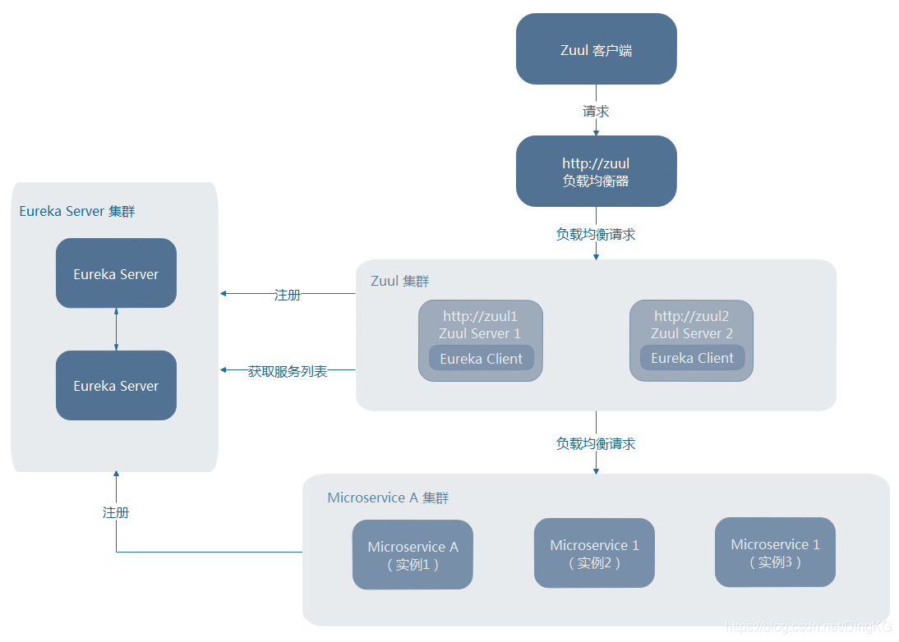
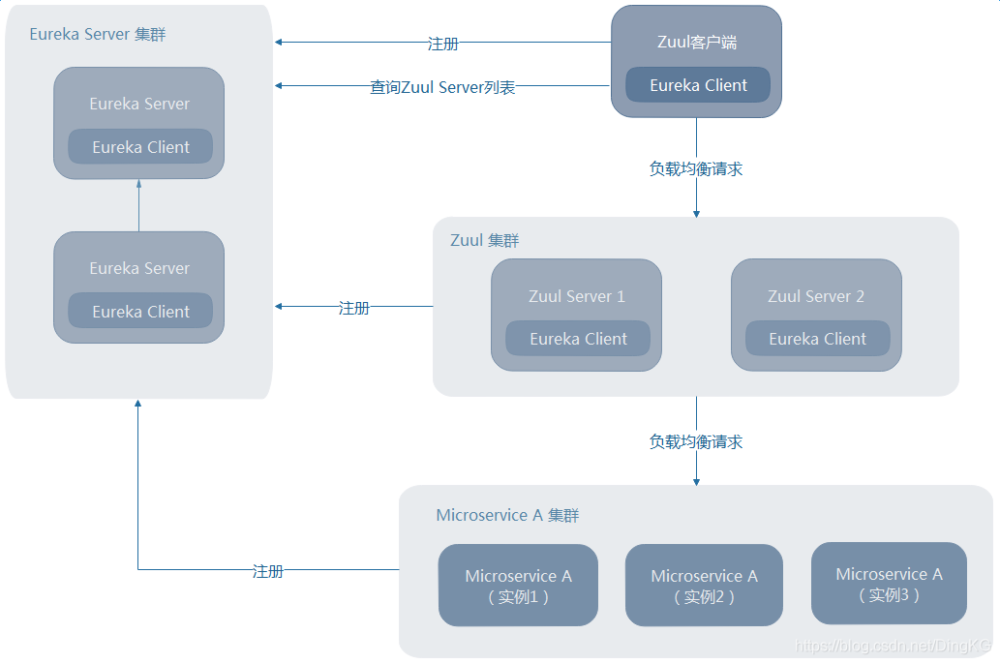

# zuul 网关
## 作用
1. 鉴权
2. 限流、熔断、超时
3. 负载均衡
4. 认证、安全
5. 开放平台功能
6. SOA等

## 构成
1. 网关
2. 后端服务
3. 注册中心

## spring zuul 网关
1. spring-boot
2. spring-boot-netflix-zuul
3. spring-cloud-starter-eureka-serve

## Arch design
##### 客户端未注册到Eureka Server上（比如手机App端等）

##### 客户端注册到Eureka Server上（内部服务调用等）

## 思考
与Nginx + lua网关功能区别

## spring 制定配置文件 
--spring.config.name=default.properties //切换其他的名称
--spring.config.location=classpath:/default.properties  //指定明确的路径 （目录位置或文件路径列表以逗号分割，查找顺序为配置反序）。
